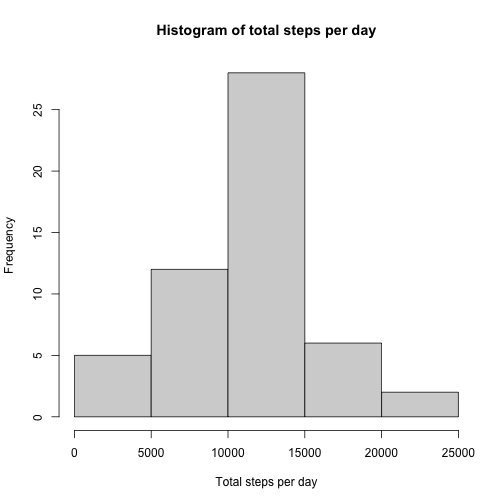
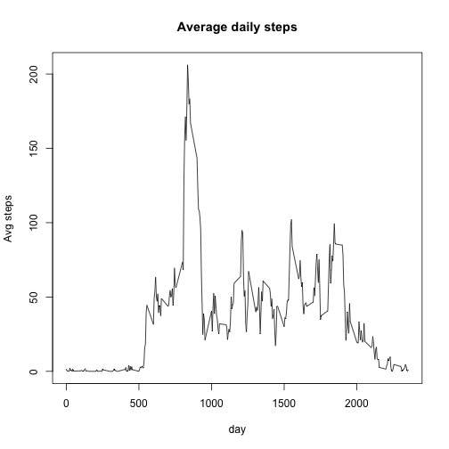
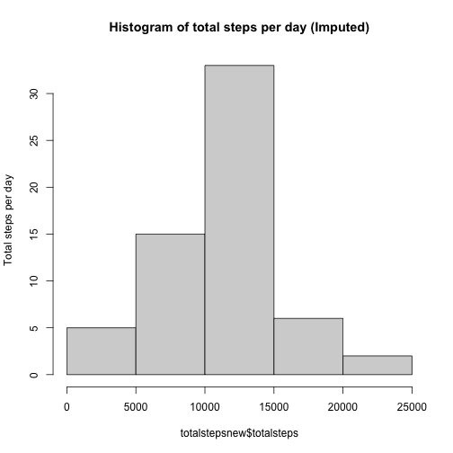
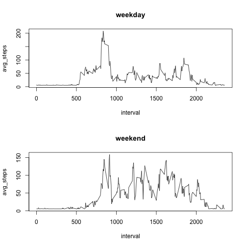

## What is mean total number of steps taken per day?

Loading and pre-processing data

```r
library(dplyr)
```

```
## 
## Attaching package: 'dplyr'
```

```
## The following objects are masked from 'package:stats':
## 
##     filter, lag
```

```
## The following objects are masked from 'package:base':
## 
##     intersect, setdiff, setequal, union
```

```r
activity <- read.csv("activity.csv")
activity <- subset(activity, !is.na(steps))
activity$date <- as.factor(activity$date)
```

Total number of steps taken per day


```r
totalsteps <-unique(activity %>% group_by(date) %>% summarise(date=date, totalsteps=sum(steps)))
```

```
## `summarise()` has grouped output by 'date'. You can override using the `.groups` argument.
```

```r
totalsteps
```

```
## # A tibble: 53 x 2
## # Groups:   date [53]
##    date       totalsteps
##    <fct>           <int>
##  1 2012-10-02        126
##  2 2012-10-03      11352
##  3 2012-10-04      12116
##  4 2012-10-05      13294
##  5 2012-10-06      15420
##  6 2012-10-07      11015
##  7 2012-10-09      12811
##  8 2012-10-10       9900
##  9 2012-10-11      10304
## 10 2012-10-12      17382
## # … with 43 more rows
```

Histogram of total number of steps per day

```r
hist(totalsteps$totalsteps, xlab="Total steps per day", main="Histogram of total steps per day")
```



```r
oldmean <- mean(totalsteps$totalsteps)
oldmedian <-median(totalsteps$totalsteps)

sum(totalsteps$totalsteps)
```

```
## [1] 570608
```
Mean total no. of steps taken per day = 1.0766189 &times; 10<sup>4</sup>

Median total no. of steps taken per day = 10765

## What is the average daily activity pattern?


```r
timeinterval <- unique(activity %>% group_by(interval) %>% summarise(interval=interval, avg_steps=mean(steps)))
```

```
## `summarise()` has grouped output by 'interval'. You can override using the `.groups` argument.
```

```r
plot(avg_steps ~ interval, data=timeinterval, type="l", main="Average daily steps", xlab="day", ylab="Avg steps")
```



```r
maxinterval <- subset(timeinterval, timeinterval$avg_steps == max(timeinterval$avg_steps))[,1]
```

The 5-min interval with average maximum number of steps across all days is 835.

## Imputing missing values
Reading in the data again to deal with missing values this time.


```r
library(lubridate)
```

```
## 
## Attaching package: 'lubridate'
```

```
## The following objects are masked from 'package:base':
## 
##     date, intersect, setdiff, union
```

```r
activity <- read.csv("activity.csv")
activity$date <- as.Date(activity$date, "%Y-%m-%d")

#adding a new column with the respective weekday
activity$day <- weekdays(activity$date)

#splitting the data by weekdays
daysplit <- split(activity, activity$day)

#writing a function which would impute missing values with the mean for that weekday
impute <- function (y) {
  y[,1][is.na(y[,1])] <- mean(y[,1], na.rm=TRUE)
  y
}
#imputing missing values
daysplitimp <- lapply(daysplit, impute)

#creating the new data frame with no missing values, "newdata"
newdata <- do.call(rbind, daysplitimp)
rownames(newdata) <- NULL

#making new histogram with the total number of steps per day
totalstepsnew <-unique(newdata %>% group_by(date) %>% summarise(date=date, totalsteps=sum(steps)))
```

```
## `summarise()` has grouped output by 'date'. You can override using the `.groups` argument.
```

```r
hist(totalstepsnew$totalsteps, ylab="Total steps per day", main="Histogram of total steps per day (Imputed)")
```



```r
newmean <- mean(totalstepsnew$totalsteps); 
newmedian <- median(totalstepsnew$totalsteps)
```

Mean total no. of steps per day (imputed) = 1.082121 &times; 10<sup>4</sup>
Median total no. of steps per day (imputed) = 1.1015 &times; 10<sup>4</sup>

old mean = 1.0766189 &times; 10<sup>4</sup> new mean = 1.082121 &times; 10<sup>4</sup>

old median = 10765 new median = 1.1015 &times; 10<sup>4</sup>

## Are there differences in activity patterns between weekdays and weekends?


```r
#creating new factor variable for weekend status

newdata <-newdata %>%
  mutate(status= ifelse(day%in% c("Saturday", "Sunday"), "weekend", "weekday"))

newdata$status <- as.factor(newdata$status)

#plotting average no. of steps taken by weekday vs weekend
weekday <- unique(subset(newdata, status=="weekday") %>% 
                    group_by(interval) %>% summarise(interval=interval, avg_steps=mean(steps)))
```

```
## `summarise()` has grouped output by 'interval'. You can override using the `.groups` argument.
```

```r
weekend <- unique(subset(newdata, status=="weekend") %>% 
                    group_by(interval) %>% summarise(interval=interval, avg_steps=mean(steps))) 
```

```
## `summarise()` has grouped output by 'interval'. You can override using the `.groups` argument.
```

```r
par(mfcol=c(2,1))
plot(avg_steps ~ interval, data=weekday, type="l", main="weekday")
plot(avg_steps ~ interval, data=weekend, type="l", main="weekend")
```


